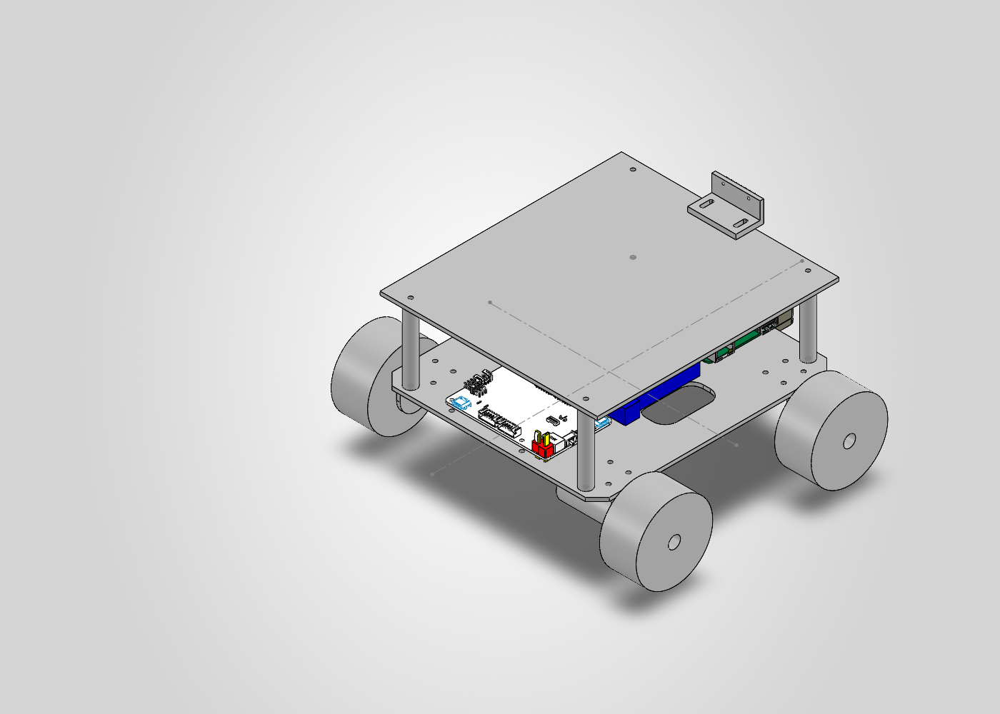

# HKU Logistics Robot — Mechanical Design

HKU DASE7503 Robotic Systems Integration · Group 8 · Work in progress

## 项目与个人贡献

物流机器人小组项目，目标为移动、托举及运输货物。本仓库记录王正的机械设计与硬件集成工作。根据本人确认，独立重建整车 SolidWorks 模型，完成底盘、电机支架、轮组、双层板、立柱和相机安装结构的布局，结合硬件测量准备加工文件。运动控制、视觉、雷达识别与路径规划由其他组员负责，不属于本人的软件成果。

## 当前进度（2026-10-09）

- 已完成：整车机械建模、硬件布局、亚克力板 DXF 加工图。
- CAD 检查：25 个组件正常加载，实体外廓约 252.60 × 240.75 × 135.50 mm；2026-10-07 的检查未检测到组件间实体干涉。
- 进行中：加工准备与实体搭建。激光切割尚未完成。
- 尚未验证：完整实车运动、负载搬运、举升机构、视觉与路径规划。

## 文件

| 路径 | 内容 |
|---|---|
| `cad/solidworks/` | 原生装配、零件及雷达 STEP 参考模型 |
| `fabrication/底板.DXF` | 底板二维加工图，外廓 180 × 236.5 mm |
| `fabrication/fix_camera.STL` | 相机支架打印候选文件，尚未验证与装配内同名零件一致 |
| `docs/design-review.md` | 尺寸、装配检查和待解决问题 |
| `docs/sources-and-scope.md` | 模型来源、个人贡献及使用边界 |

## 打开模型

完整下载文件夹后，用兼容版本的 SolidWorks 打开 `cad/solidworks/整体.SLDASM`，保持零件文件在同一目录。原文件由 SolidWorks 2026 环境检查；不同版本兼容性需核对。雷达以 STEP 导入，原装配引用曾解析到临时目录；若重新打开提示缺失，应从同目录的 `MS200_X1_20221110.stp` 重新定位/导入，不应认为本包已经通过异机重开验证。

## 加工与尺寸边界

DXF 为二维图，需向加工方明确毫米单位、1:1 比例、材料和板厚。当前 CAD 外廓处于用户提供的 300 × 300 × 180 mm 限制内，但没有计入未知线缆、紧固件外伸与举升后的高度。CAD 无干涉不能证明承载能力或实车运行可靠性。

不包含课程 PDF、私人简历、联系方式或开发过程中的临时文件。第三方模型的再分发许可尚未核实，仓库默认用于私有项目归档。
